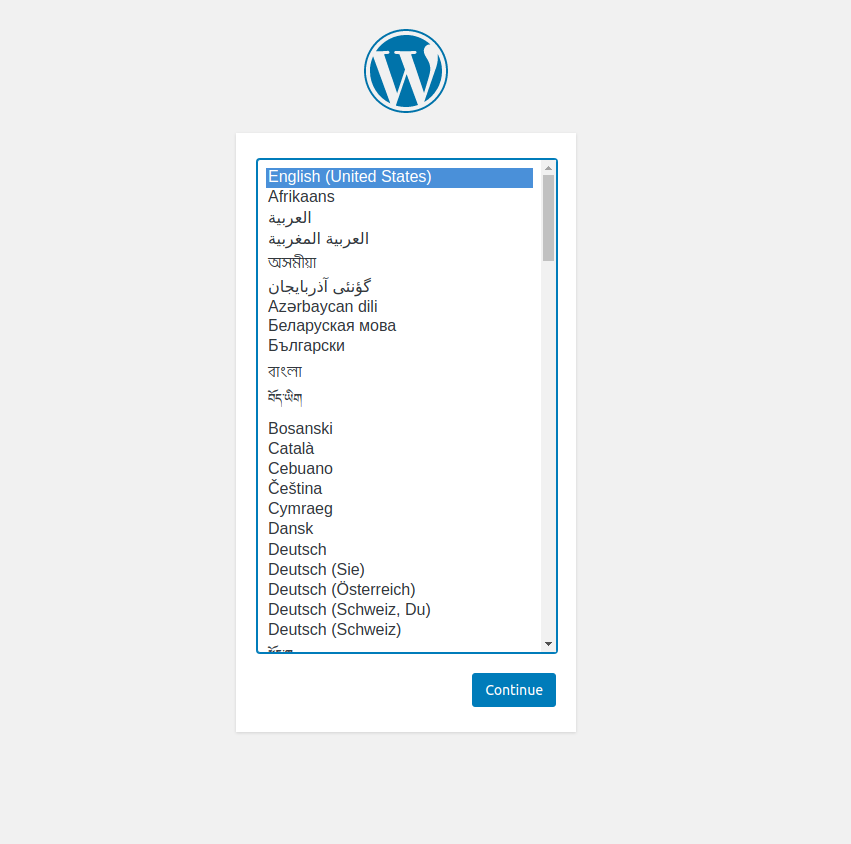

# docker-compose-wordpress

Docker compose to create a wordpress deployment using official wordpress and mysql images.

#1 Place docker-compose.yml in working directory

#2 Run the below:

> docker-compose up -d

#3 Then browse to http://localhost:8000 to complete wordpress setup.

To destroy the containers issue:

> docker-compose down --volumes